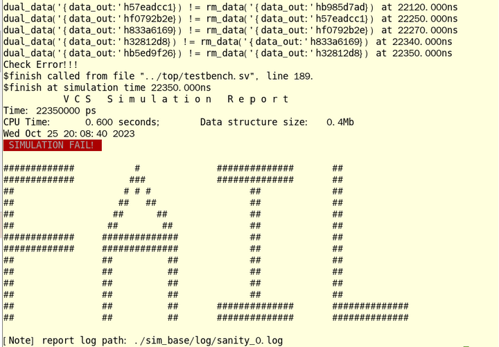
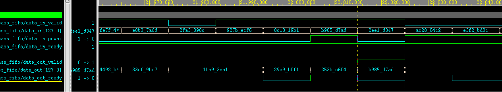

# auto_testbench说明文档

## 前言

兄弟萌，

当你着手开始写新的RTL时，想不想边写边编译边清理bug呢？

当你对一个语法感到费劲，需不需要立刻有个环境做一下实验呢？

当你费了九牛二虎之力终于写完个模块时，有没有立刻看看波形的悸动呢？

当你完成了初步的debug之后，要不要来些独立自主的随机测试呢？

那么请不要犹豫，果断来入手一波疑似RTL定向验证的巅峰之作auto_testbench吧！

## 更新记录

| 时间       | 更新                                                                                  | 说明                                                                           |
| -------- | ----------------------------------------------------------------------------------- | ---------------------------------------------------------------------------- |
| 2024/2/1 | 1.增加了sim_start/sim_finish/sim_finish_pulse等控制逻辑<br>2.修改了仿真结束机制<br>3.修改了代码对齐不规整的严重问题 | 1.握手接口的驱动会在sim_start为1后进行<br>2.增加了在sim_finish为1的1000ns后结束仿真的线程<br>3.代码变更好看了！ |

## 功能列表

1. 基于输入生成可编译仿真的RTL验证与执行环境；
2. 自动例化顶层，进行时钟和复位驱动；
3. 自动对端口进行随机；
4. 针对握手接口进行协议随机优化；
5. 可选择增加自动比对环境；
6. 生成用于实验的空仿真环境；

## 使用说明

脚本工作于linux环境，下载工程后执行命令：

```
{$script_path}/auto_testbench [-f module.v] [-v]
```

-f：后缀rtl的文件名，推荐在rtl所在目录下进行执行，也支持带有路径，如不加则生成空工程用于仿真；

-v：表示需要自动生成比对环境代码，否则只生成仿真环境；

生成的仿真环境如下（以v1版本下的bypass_fifo.v为例）：

```
    .
    ├── cfg
    │   ├── cfg.mk
    │   ├── check_fail.pl
    │   ├── run.do
    │   └── tb.f
    ├── sim
    │   └── Makefile
    ├── top
    │   └── testbench.sv
    └── ver
        └── bypass_fifo_pkg.sv
```

top目录下的testbench.sv是赏心悦目的顶层文件：


在sim目录下执行：

```
make run [seed=xxx] [wave=on/off][mode=xxx]
```

可进行环境仿真，仿真结果会放置于mode同名目录下，可进行波形debug：

```
verdi -ssf [mode]/wave/xxx.fsdb &
```

## 使用示例

### 波形验证

bypass_fifo是本工具的一个测试模块，其接口如下：

```
module bypass_fifo #(
    parameter DEPTH = 8,
    parameter WIDTH = 128
)(
    input               clk,
    input               rst_n,

    input               data_in_valid,
    input  [WIDTH -1:0] data_in,
    input               data_in_power,
    output              data_in_ready,

    output              data_out_valid,
    output [WIDTH -1:0] data_out,
    input               data_out_ready
);
```

其功能是一个握手型fifo，但是只有data_in_power为1的数据会被输出，其他数据会被丢弃。咱先不说这个功能为啥这么奇怪（事实上这是一对多fifo的一部分），就单纯聊怎么验证这个模块。

在bypass_fifo.v的同级目录下输入：

```
{$script_path}/auto_testbench -f bypass_fifo.v
```

会得到如下的提示内容：

```
##====================================================================##
Gen over! please cd ./bypass_fifo_verification/simYou need modify ./bypass_fifo_verification/top/testbench.sv    like cp ./bypass_fifo_verification_bak/top/testbench.sv ./bypass_fifo_verification/top/You need modify ./bypass_fifo_verification/cfg/tb.f    like cp ./bypass_fifo_verification_bak/cfg/tb.f ./bypass_fifo_verification/cfg/
##====================================================================##
```

提示内容的意思就是：

现在你可以到sim目录去跑仿真了。如果你之前目录下有一个bypass_fifo_verification那我已经把它改名成bypass_fifo_verification_bak目录了，你看看要不要把旧的testbench.sv拷贝过来用，顺便看看tb.f是不是也得拷过来呀。

不管这些，直接跳转到./bypass_fifo_verification/sim目录，执行make cmp进行编译。正常来说编译会直接通过，遇到错了就根据报错进行排查。如果报文件缺失，那么请打开 ./bypass_fifo_verification/cfg/tb.f：

```
+libext+.v+.sv
-y /home/ICer/gitee_path/auto_testbench/src/
/home/ICer/gitee_path/auto_testbench/src/bypass_fifo.v
../top/testbench.sv
```

这个文件里会把bypass_fifo.v所在的目录设置为全局搜索目录，如果这样不足以涵盖内部调用的模块，那么请进一步修改该文件。

修改掉全部的编译bug后编译即可通过，之后打开 ./bypass_fifo_verification/top/testbench.sv文件，按照自己的需求修改。在该文件中对信号进行了四种力度的随机：

1. valid握手信号：在与对应的ready信号握手后，随机跳变；

2. ready握手信号：每拍随机跳变；

3. info握手信号：在对应的valid&ready信号握手后，或者valid为0时，随机跳变；

4. 其他信号：initial内随机赋初始值；

举个例子，对于data_in_power，其生成逻辑是这样的：

```
always @(posedge clk or negedge rst_n)begin
    if(~rst_n)begin
        data_in_power <= 'x;
    end
    else if(data_in_valid && data_in_ready)begin
        data_in_power <= $urandom;
    end
    else if(data_in_valid == 0)begin
        data_in_power <= $urandom;
    end
end
```

上述内容由于涉及到信号识别以及信号匹配，所以很容易出问题（比如aa_bb_rvalid应该找bb_aa_rready，但是可能误找到bb_aa_wready），所以一般需要检查和按照需求修改下。

修改完成后，在sim目录下键入make run seed=0 wave=on进行仿真，等待pass（必然pass因为都没有比对）：


之后通过verdi -ssf sim_base/wave/sanity_0.fsdb &打开波形即可：


### 自动比对

对于一种场景的模块，建议加入自动比对：单一握手型输出的模块。仍以bypass_fifo为例，如果想要加入自动比对，那么在生成时后缀-v即可：

```
{$script_path}/auto_testbench -f bypass_fifo.v -v
```

此时生成的环境中，多了一个文件./bypass_fifo_verification/ver/bypass_fifo_pkg.sv：

```
package bypass_fifo_pkg;

    parameter ERROR_DEBUG_CNT = 5;
    parameter DEPTH = 8;
    parameter WIDTH = 128;

    int error_cnt = 0;
    bit check_en  = 0;

    typedef struct{
        bit [WIDTH -1:0] data_in;
        bit  data_in_power;
    } data_in_valid_struct;
    data_in_valid_struct data_in_valid_bus_q[$];

    typedef struct{
        bit [WIDTH -1:0] data_out;
    } data_out_valid_struct;
    data_out_valid_struct rm_q[$];
    data_out_valid_struct data_out_valid_bus_q[$];

endpackage
```

简单说下思路，工具将若干输入和输出封装为struct，并且声明输入输出队列和一个输出类型的rm队列。在testbench中补充了四个task：

in_queue_gain：获取输入数据，并写入输入队列；

out_queue_gain：获取输出数据，并写入输出队列；

rm_queue_gain：使用输入队列，预期输出数据，并写入rm队列；

queue_check：对比输出队列与rm队列，对比不通过则报错，这个task是固定的不需要修改；

对bypass_fifo而言，前两个方法已经生成正确，不需要修改：

```
task in_queue_gain();
  while(1)begin
    @(negedge clk);
    if(data_in_valid && data_in_ready)begin
      data_in_valid_struct data_in_valid_dat;
      data_in_valid_dat.data_in = data_in;
      data_in_valid_dat.data_in_power = data_in_power;
      data_in_valid_bus_q.push_back(data_in_valid_dat);
    end//if-end 
  end//while-end 
endtask: in_queue_gain

task out_queue_gain();
  while(1)begin
    @(negedge clk);
    if(data_out_valid && data_out_ready)begin
      data_out_valid_struct data_out_valid_dat;
      data_out_valid_dat.data_out = data_out;
      data_out_valid_bus_q.push_back(data_out_valid_dat);
    end//if-end 
  end//while-end 
endtask: out_queue_gain
```

而需要修改的是对rm的预期，根据data_in_power判定数据是否需要输出：

```
task rm_queue_gain();
  data_in_valid_struct data_in_valid_dat;
  data_out_valid_struct data_out_valid_dat;
  while(1)begin
    wait(data_in_valid_bus_q.size > 0);
    data_in_valid_dat = data_in_valid_bus_q.pop_front();
    if(data_in_valid_dat.data_in_power === 1'b1)begin
        data_out_valid_dat.data_out = data_in_valid_dat.data_in;
        rm_q.push_back(data_out_valid_dat);
    end
  end
endtask: rm_queue_gain
```

完成修改后，将./bypass_fifo_verification/ver/bypass_fifo_pkg.sv中的check_en修改为1，重新跑仿真：



此时会发现比对未通过（这个模块确实有功能bug），打开波形确认'hb985d7ad这个数是怎么个情况：



发现'hb985d7ad这个数输出没有握手就data_out_valid跳变了，显然是功能性bug。

### 简单环境生成

有时我们没有要验证的模块，只是想基于SV的环境做一些实验，那么可以通过auto_testbench来生成一个可执行的空环境：

```
{$script_path}/auto_testbench
```

之后正常进行实验和仿真即可。
