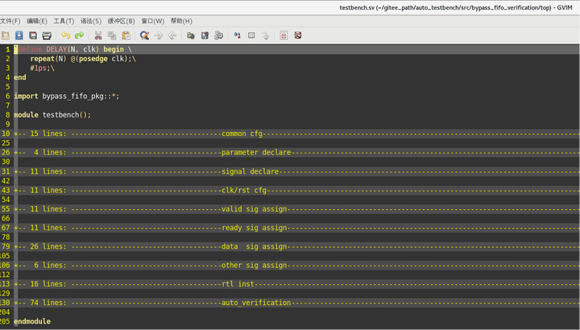
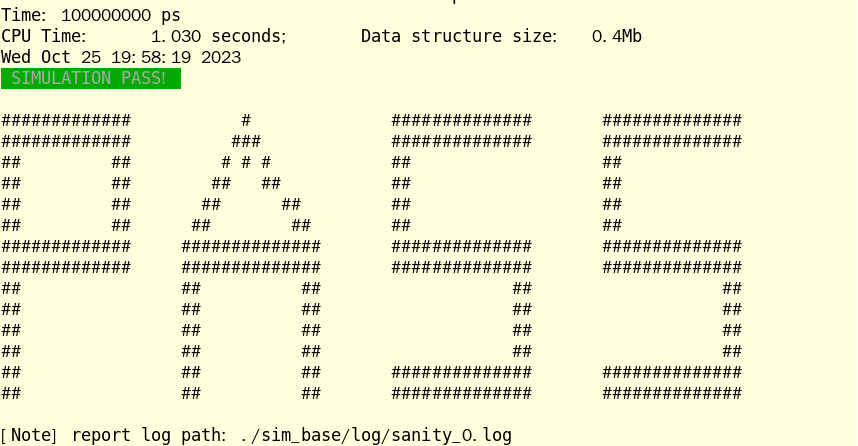
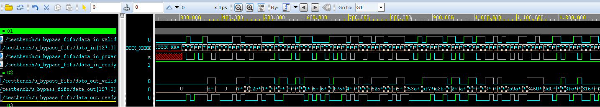
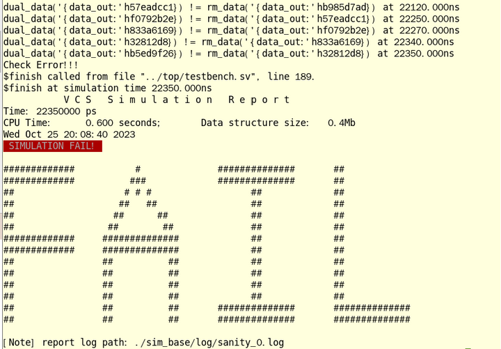
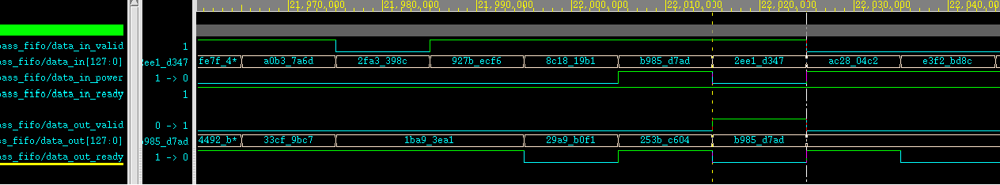

# auto_testbench

## Preface

Dear colleagues,

When you start writing new RTL, do you want to compile and debug bugs while writing?

When you struggle with a syntax, do you need an environment to experiment with immediately?

When you've put in a lot of effort to finally finish a module, do you want to see the heartbeat of the waveforms immediately?

After completing the preliminary debugging, do you want to do some independent random testing?

So please don't hesitate, decisively start with what seems to be the pinnacle of RTL-oriented verification, the auto_testbench!

## Update Log

| Date     | Update                                                                                                                                                                            | Description                                                                                                                                                                                                       |
| -------- | --------------------------------------------------------------------------------------------------------------------------------------------------------------------------------- | ----------------------------------------------------------------------------------------------------------------------------------------------------------------------------------------------------------------- |
| 2024/2/1 | 1. Added sim_start/sim_finish/sim_finish_pulse and other control logic<br>2. Modified the simulation end mechanism<br>3. Modified the serious problem of irregular code alignment | 1. The driving of the handshake interface will be carried out after sim_start is 1<br>2. Added a thread to end the simulation 1000ns after sim_finish is 1<br>3. The code has become more aesthetically pleasing! |

## Feature List

1. Generates a compilable simulation RTL verification and execution environment based on input;
2. Automatically instantiates the top level and drives the clock and reset;
3. Randomly drives ports automatically;
4. Optimizes the protocol for handshake interfaces randomly;
5. Optionally adds an automatic comparison environment;
6. Generates an empty simulation environment for experiments;

## Instructions for Use

The script works in the Linux environment. After downloading the project, execute the command:

```
{$script_path}/auto_testbench [-f module.v] [-v]
```

-f: The file name with the suffix rtl, it is recommended to execute in the directory where the rtl is located, and it also supports paths. If not added, an empty project will be generated for simulation;

-v: Indicates that the automatic comparison environment code needs to be generated, otherwise only the simulation environment is generated;

The generated simulation environment is as follows (taking the bypass_fifo.v under version 1 as an example):

```
    .
    ├── cfg
    │   ├── cfg.mk
    │   ├── check_fail.pl
    │   ├── run.do
    │   └── tb.f
    ├── sim
    │   └── Makefile
    ├── top
    │   └── testbench.sv
    └── ver
        └── bypass_fifo_pkg.sv
```

The testbench.sv under the top directory is an aesthetically pleasing top-level file:



Execute in the sim directory:

```
make run [seed=xxx] [wave=on/off][mode=xxx]
```

You can perform environment simulation, and the simulation results will be placed in the directory with the same name as mode, and waveform debugging can be performed:

```
verdi -ssf [mode]/wave/xxx.fsdb &
```

## Usage Examples

### Waveform Verification

The bypass_fifo is a test module of this tool, and its interface is as follows:

```
module bypass_fifo #(
    parameter DEPTH = 8,
    parameter WIDTH = 128
)(
    input               clk,
    input               rst_n,

    input               data_in_valid,
    input  [WIDTH -1:0] data_in,
    input               data_in_power,
    output              data_in_ready,

    output              data_out_valid,
    output [WIDTH -1:0] data_out,
    input               data_out_ready
);
```

Its function is a handshake type FIFO, but only data where data_in_power is 1 will be output, and other data will be discarded. Let's not talk about why this function is so strange (in fact, it is part of a one-to-many FIFO), just talk about how to verify this module.

Enter in the same directory level as bypass_fifo.v:

```
{$script_path}/auto_testbench -f bypass_fifo.v
```

You will get the following prompt content:

```
##====================================================================##
Gen over! please cd ./bypass_fifo_verification/simYou need modify ./bypass_fifo_verification/top/testbench.sv    like cp ./bypass_fifo_verification_bak/top/testbench.sv ./bypass_fifo_verification/top/You need modify ./bypass_fifo_verification/cfg/tb.f    like cp ./bypass_fifo_verification_bak/cfg/tb.f ./bypass_fifo_verification/cfg/
##====================================================================##
```

The meaning of the prompt is:

Now you can go to the sim directory to run the simulation. If you have a bypass_fifo_verification directory before, I have already renamed it to bypass_fifo_verification_bak directory, you can see if you want to copy the old testbench.sv over, and also see if tb.f also needs to be copied over.

Regardless, jump directly to the ./bypass_fifo_verification/sim directory and execute make cmp to compile. Normally, the compilation will pass directly, and if there is an error, troubleshoot according to the error report. If the file is missing, then please open ./bypass_fifo_verification/cfg/tb.f:

```
+libext+.v+.sv
-y /home/ICer/gitee_path/auto_testbench/src/
/home/ICer/gitee_path/auto_testbench/src/bypass_fifo.v
../top/testbench.sv
```

This file sets the directory where bypass_fifo.v is located as a global search directory. If this is not enough to cover the internal called modules, then please modify it further.

After fixing all the compilation bugs, compile and pass, then open the ./bypass_fifo_verification/top/testbench.sv file and modify it according to your own needs. In this file, the signals are randomized with four levels of strength:

1. Valid handshake signal: Randomly toggle after handshaking with the corresponding ready signal;

2. Ready handshake signal: Randomly toggle every beat;

3. Info handshake signal: Randomly toggle after the corresponding valid & ready signal handshake, or when valid is 0;

4. Other signals: Randomly assigned initial values in the initial block;

For example, for data_in_power, the generation logic is as follows:

```
always @(posedge clk or negedge rst_n)begin
    if(~rst_n)begin
        data_in_power <= 'x;
    end
    else if(data_in_valid && data_in_ready)begin
        data_in_power <= $urandom;
    end
    else if(data_in_valid == 0)begin
        data_in_power <= $urandom;
    end
end
```

The above content is prone to problems due to signal recognition and signal matching (for example, aa_bb_rvalid should find bb_aa_rready, but may mistakenly find bb_aa_wready), so it generally needs to be checked and modified according to the requirements.

After modification, enter make run seed=0 wave=on in the sim directory for simulation and wait for pass (it will pass inevitably because there is no comparison):



Then open the waveform through verdi -ssf sim_base/wave/sanity_0.fsdb &:



### Automatic Comparison

For a module of a certain scenario, it is recommended to add automatic comparison: a module with a single handshake-type output. Still taking bypass_fifo as an example, if you want to add automatic comparison, you can simply add a suffix -v when generating:

```
{$script_path}/auto_testbench -f bypass_fifo.v -v
```

At this time, an additional file is generated in the environment: ./bypass_fifo_verification/ver/bypass_fifo_pkg.sv:

```
package bypass_fifo_pkg;

    parameter ERROR_DEBUG_CNT = 5;
    parameter DEPTH = 8;
    parameter WIDTH = 128;

    int error_cnt = 0;
    bit check_en  = 0;

    typedef struct{
        bit [WIDTH -1:0] data_in;
        bit  data_in_power;
    } data_in_valid_struct;
    data_in_valid_struct data_in_valid_bus_q[$];

    typedef struct{
        bit [WIDTH -1:0] data_out;
    } data_out_valid_struct;
    data_out_valid_struct rm_q[$];
    data_out_valid_struct data_out_valid_bus_q[$];

endpackage
```

In simple terms, the tool encapsulates several inputs and outputs as structs, and declares input and output queues and an output type rm queue. In the testbench, four tasks are added:

in_queue_gain: Obtain input data and write it to the input queue;

out_queue_gain: Obtain output data and write it to the output queue;

rm_queue_gain: Use the input queue, expected output data, and write it to the rm queue;

queue_check: Compare the output queue with the rm queue, and report an error if the comparison fails. This task is fixed and does not need to be modified;

For bypass_fifo, the first two methods have been generated correctly and do not need to be modified:

```
task in_queue_gain();
  while(1)begin
    @(negedge clk);
    if(data_in_valid && data_in_ready)begin
      data_in_valid_struct data_in_valid_dat;
      data_in_valid_dat.data_in = data_in;
      data_in_valid_dat.data_in_power = data_in_power;
      data_in_valid_bus
_q.push_back(data_in_valid_dat);
    end//if-end 
  end//while-end 
endtask: in_queue_gain

task out_queue_gain();
  while(1)begin
    @(negedge clk);
    if(data_out_valid && data_out_ready)begin
      data_out_valid_struct data_out_valid_dat;
      data_out_valid_dat.data_out = data_out;
      data_out_valid_bus_q.push_back(data_out_valid_dat);
    end//if-end 
  end//while-end 
endtask: out_queue_gain
```

What needs to be modified is the expectation of rm, based on data_in_power to determine whether the data needs to be output:

```
task rm_queue_gain();
  data_in_valid_struct data_in_valid_dat;
  data_out_valid_struct data_out_valid_dat;
  while(1)begin
    wait(data_in_valid_bus_q.size > 0);
    data_in_valid_dat = data_in_valid_bus_q.pop_front();
    if(data_in_valid_dat.data_in_power === 1'b1)begin
        data_out_valid_dat.data_out = data_in_valid_dat.data_in;
        rm_q.push_back(data_out_valid_dat);
    end
  end
endtask: rm_queue_gain
```

After the modification is complete, change the check_en in ./bypass_fifo_verification/ver/bypass_fifo_pkg.sv to 1 and rerun the simulation:



At this time, it will be found that the comparison failed (this module indeed has a functional bug), open the waveform to confirm what is the situation with the number 'hb985d7ad:



It is found that the number 'hb985d7ad output did not handshake and data_out_valid toggled, which is obviously a functional bug.

### Simple Environment Generation

Sometimes we don't have a module to verify, but just want to do some experiments based on the SV environment, then you can use auto_testbench to generate an executable empty environment:

```
{$script_path}/auto_testbench
```

After that, you can proceed with experiments and simulations as usual.
